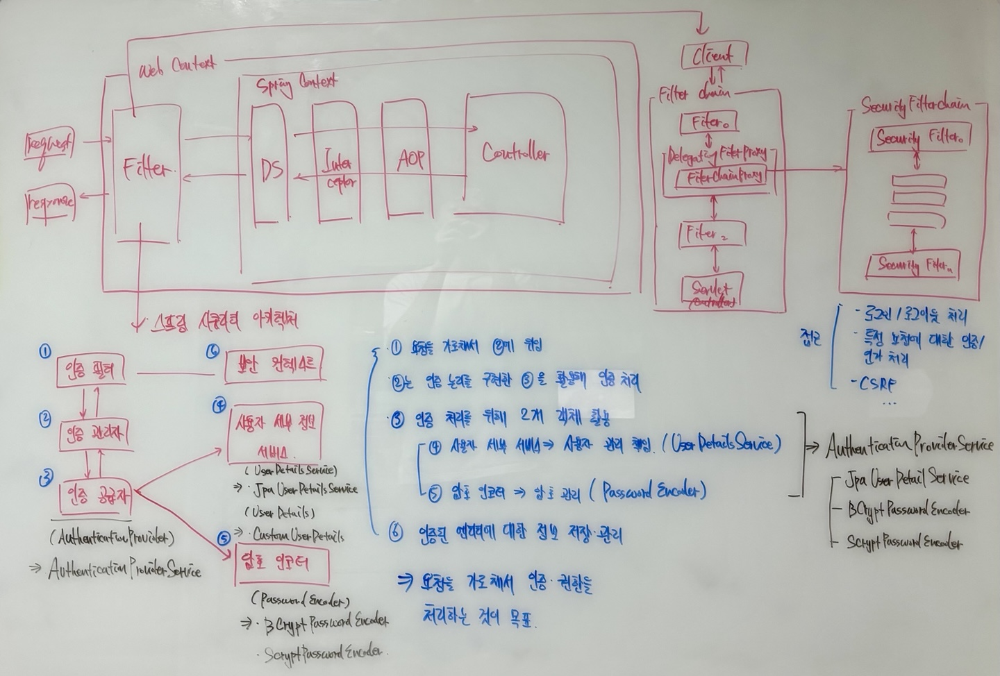

# 스프링 시큐리티를 활용한 간단한 로그인, 로그아웃, 회원가입 구현

## 동작 원리 구조

- 스프링 시큐리티의 핵심은 <strong>클라이언트의 요청을 가로채서 인증/권한에 대한 작업을 처리하는 것</strong>
- 인증 필터 : 클라이언트의 요청을 가로채서 인증 관리자에게 위임
- 인증 관리자 : 인증 논리를 구현한 '인증 공급자'를 활용해 인증 처리
- 인증 공급자 : 인증 처리하는 논리를 구현한 객체
  - (1) 사용자 세부 서비스 -> 사용자 관리 책임
  - (2) 암호 인코더 -> 암호 관리
- 보안 컨텍스트 : 인증된 정보 저장 및 관리

 

## 비즈니스
- 메인 비즈니스는 로그인, 로그아웃, 회원가입 기능을 구현
- 로그인, 로그아웃 기능은 스프링 시큐리티에서 기본으로 제공하는 기본 템플릿을 활용
- 사용자를 조회 할 수 있는 기능을 제공
- 회원가입은 REST API 를 구현하여 API 호출을 통해 구현
  - 회원가입 시 사용자는 기본으로 READ 권한이 부여됨
  - 비밀번호는 기본적으로 BCRYPT 알고리즘으로 인코딩됨
- 권한을 추가, 삭제, 조회할 수 있음
  - 권한의 종류는 READ, WRITE 로 두 종류가 존재함 
